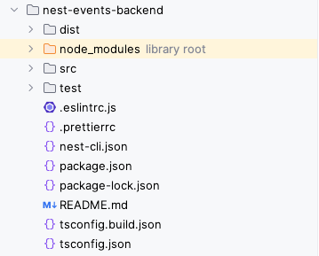

# Struttura

- ## Cartelle
  - dist (dove verranno messi i files compilati)
  - node_modules (dove vengono installate le dipendenze dichiarate in package.json)
  - src (dove sta il codice sorgente)
  - test (dove metteremo i test)

- ## config files:
  - .eslintrc.js (configurazione [eslint](https://eslint.org/) per il code editor)
  - .prettierrc (configurazione [prettier](https://prettier.io/docs/en/configuration.html))
  - nest-cli.json (some more configuration to have NestJS working and compiling)
  - package.json (definisce le caratteristiche del progetto, le sue `dependencies` e `devDependencies`, gli `scripts` eseguibili, la struttura dei test `jest`)
  - package.json ()
  - tsconfig.json (definisce dove e come compilare)

- ## [Gli script](./struttura/script.md)
  - [start:dev](./struttura/script.md#startdev)

- ## [Files](./struttura/files.md)
  - [./src/main.ts](./struttura/files.md#srcmaints)

- ## [Sintassi](./struttura/sintassi.md)
  - [Decorators](./struttura/sintassi.md#decorators)
    - [Controller](./struttura/sintassi.md#controller)
    - [Method](./struttura/sintassi.md#method-getpostdeleteputall-)
    - [Param](./struttura/sintassi.md#param)
    - [Body](./struttura/sintassi.md#body)
    - [Query](./struttura/sintassi.md#query)
    - [Module](./../README.md/)

---
[Home](./../README.md)
