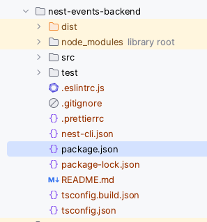
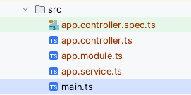

# Struttura



Questa é la struttura di un progetto NestJS.
## Le cartelle:
- dist: contiene i file compilati
- node_modules: contiene le dipendenze
- [src](#src): contiene il codice sorgente
- test: contiene i test

## I files:
- .eslintrc.js: contiene le regole per l'analisi statica del codice
- .gitignore: contiene i file che git deve ignorare
- .prettierrc: contiene le regole per la formattazione del codice
- nest-cli.json: contiene le configurazioni per il CLI di NestJS
- package.json: contiene le dipendenze e i comandi per l'esecuzione del progetto
- package-lock.json: contiene le dipendenze e le versioni esatte
- README.md: contiene la documentazione del progetto
- tsconfig.build.json: contiene le configurazioni per la compilazione del codice
- tsconfig.json: contiene le configurazioni per il compilatore TypeScript

## src
La cartella piu importante é `src` che contiene il codice sorgente del progetto.

Il file `main.ts` é il punto di ingresso dell'applicazione, mentre `app.module.ts` 
é il modulo principale dell'applicazione.

## Files (all'interno di src)

### [./src/main.ts](./../nest-events-backend/src/main.ts)
É il file principale, da qui parte tutto. Importa i files necessari per l'avvio 
dell'applicazione, quindi crea un oggetto applicazione, lo avvia e lo mette in \
ascolto sulla porta selezionata (in questo caso 3000).

```typescript
import { NestFactory } from '@nestjs/core';
import { AppModule } from './app.module';

async function bootstrap() {
  const app = await NestFactory.create(AppModule);
  await app.listen(3000);
}
bootstrap();
```

### [./src/app.module.ts](./../nest-events-backend/src/app.module.ts)
É il modulo principale dell'applicazione. Importa i moduli necessari per l'esecuzione
dell'applicazione.

### [./src/app.controller.ts](./../nest-events-backend/src/app.controller.ts)
É il controller per il modulo principale dell'applicazione. Gestisce le richieste HTTP
per il root path.

### [./src/app.service.ts](./../nest-events-backend/src/app.service.ts)
É il service per il modulo principale dell'applicazione. Contiene la logica per 
la gestione delle richieste HTTP per il root path.

### [./src/app.controller.spec.ts](./../nest-events-backend/src/app.controller.spec.ts)
É il file di test per il controller principale dell'applicazione. Tutti i files 
di test hanno lo stesso nome del file che testano, con l'aggiunta di `.spec` prima
dell'estensione `ts`.

## [Controllers](./struttura/controllers.md)

## [Gli script](./struttura/script.md)

## [Files](./struttura/files.md)

## [Sintassi](./struttura/sintassi.md)

---
[Home](./../README.md)
